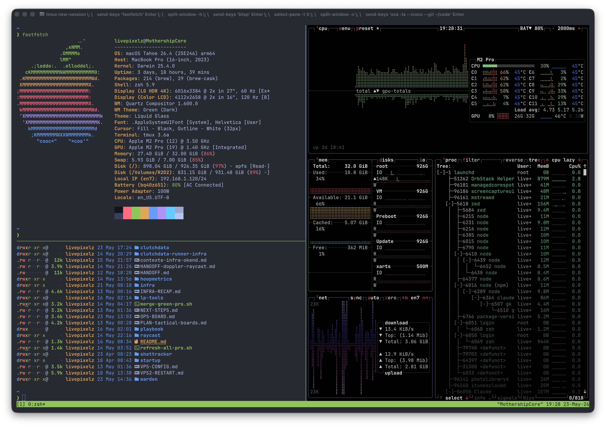

```
 ██████╗  ██████╗ ████████╗███████╗██╗██╗     ███████╗███████╗
 ██╔══██╗██╔═══██╗╚══██╔══╝██╔════╝██║██║     ██╔════╝██╔════╝
 ██║  ██║██║   ██║   ██║   █████╗  ██║██║     █████╗  ███████╗
 ██║  ██║██║   ██║   ██║   ██╔══╝  ██║██║     ██╔══╝  ╚════██║
 ██████╔╝╚██████╔╝   ██║   ██║     ██║███████╗███████╗███████║
 ╚═════╝  ╚═════╝    ╚═╝   ╚═╝     ╚═╝╚══════╝╚══════╝╚══════╝
                                              by @Livepixelz 👁️‍🗨️
```



> macOS-first · zsh · chezmoi · opinionated

My personal dev environment. One command to go from a fresh machine to a fully working setup.

```
╭─────────────────────────────────────────────────────────────────────────────╮
│                                                                             │
│  ~/code/my-project  on  main ✔  via  ⬢ v26.2.0  via 🐍 v3.14.5            │
│  ❯ ll                                                                       │
│                                                                             │
│  drwxr-xr-x  ● src          ─── 3 hours ago                                │
│  drwxr-xr-x  ● node_modules ─── 2 days ago                                 │
│  .rw-r--r--  ● package.json ─── 3 hours ago                                │
│  .rw-r--r--  ● README.md    ─── 1 day ago                                  │
│  .rw-r--r--  ● tsconfig.json── 5 days ago                                  │
│                                                                             │
│  ~/code/my-project  on  main ✔                                              │
│  ❯ cat src/index.ts                                                         │
│                                                                             │
│    1  import { createApp } from 'vue'          ← syntax highlighted         │
│    2  import App from './App.vue'              ← line numbers               │
│    3                                           ← git diff indicators        │
│    4  createApp(App).mount('#app')                                          │
│                                                                             │
│  ~/code/my-project  on  main ✔                                              │
│  ❯ z proj  ──▶  jumped to ~/code/my-project   ← zoxide frecency magic      │
│                                                                             │
│  ~/code/my-project  on  main ✔                                              │
│  ❯ lg                           ← lazygit opens here                       │
│                                                                             │
│  ┌ Branches ────┐ ┌ Commits ──────────────────────────────────────────┐    │
│  │ * main       │ │ abc1234 feat: add dashboard view           2h ago │    │
│  │   feat/auth  │ │ def5678 fix: mobile nav overlap            1d ago │    │
│  └──────────────┘ └───────────────────────────────────────────────────┘    │
│                                                                             │
╰─────────────────────────────────────────────────────────────────────────────╯
```

---

## ⚡ Install

```bash
git clone git@github.com:Livepixelz/dotfiles.git ~/.local/share/chezmoi
bash ~/.local/share/chezmoi/install.sh
```

That's it. The script handles everything — tools, plugins, runtimes, dotfiles.

---

## 📦 What's inside

### 🐚 Shell
| | |
|---|---|
| [zsh](https://zsh.org) | Shell |
| [starship](https://starship.rs) | Prompt — fast, minimal, context-aware |
| [atuin](https://atuin.sh) | Shell history with search, sync, and stats |
| [zoxide](https://github.com/ajeetdsouza/zoxide) | Smarter `cd` — jump to any dir by frecency |
| [fzf](https://github.com/junegunn/fzf) | Fuzzy finder wired into everything |
| [fast-syntax-highlighting](https://github.com/zdharma-continuum/fast-syntax-highlighting) | Syntax colors as you type |
| [zsh-autosuggestions](https://github.com/zsh-users/zsh-autosuggestions) | Fish-like suggestions from history |

### 🔁 CLI replacements
| Instead of | Use | Why |
|---|---|---|
| `ls` | [eza](https://github.com/eza-community/eza) | Icons, git status, tree view |
| `cat` | [bat](https://github.com/sharkdp/bat) | Syntax highlighting, line numbers |
| `find` | [fd](https://github.com/sharkdp/fd) | Faster, respects `.gitignore` |
| `grep` | [ripgrep](https://github.com/BurntSushi/ripgrep) | Much faster, sane defaults |
| `cd` | [zoxide](https://github.com/ajeetdsouza/zoxide) | Learns your habits |
| `top` | [btop](https://github.com/aristocratsearch/btop) | Beautiful, actually readable |

### 🛠️ Dev tools
| | |
|---|---|
| [mise](https://mise.jdx.dev) | Runtime manager — node, python, and more |
| [lazygit](https://github.com/jesseduffield/lazygit) | Git TUI — never type `git rebase` again |
| [git-delta](https://github.com/dandavison/delta) | Diff with syntax highlighting |
| [yazi](https://github.com/sxyazi/yazi) | Terminal file explorer with previews |
| [tmux](https://github.com/tmux/tmux) | Terminal multiplexer |
| [fastfetch](https://github.com/fastfetch-cli/fastfetch) | System info on terminal open |
| [direnv](https://direnv.net) | Per-directory env vars |

---

## 🔒 Private config

`.zshrc` automatically sources `~/.zsh_private` if it exists. This file is **never committed** — put anything machine-specific or sensitive in there.

```bash
touch ~/.zsh_private
```

```zsh
# ~/.zsh_private — not versioned

export SSH_AUTH_SOCK="$HOME/Library/Group Containers/2BUA8C4S2C.com.1password/t/agent.sock"

alias vps1='ssh user@1.2.3.4'
alias work='cd ~/code/my-project'

export OPENAI_API_KEY="sk-..."
```

---

## 🔄 Daily workflow

```bash
chezmoi edit ~/.zshrc   # edit a dotfile
chezmoi diff            # preview changes
chezmoi apply           # apply to home dir
chezmoi cd              # open the repo
```

---

## 📁 Tracked files

| Repo | Home |
|---|---|
| `dot_zshrc` | `~/.zshrc` |
| `dot_gitconfig.tmpl` | `~/.gitconfig` |
| `dot_gitignore_global` | `~/.gitignore_global` |
| `dot_config/starship.toml` | `~/.config/starship.toml` |
| `dot_zsh/` | `~/.zsh/` |

---

## 🐧 macOS vs Linux

- Homebrew on macOS, apt + official installers on Linux
- `bat` → `batcat` on Ubuntu (symlinked automatically)
- `fd` → `fdfind` on Ubuntu (symlinked automatically)
